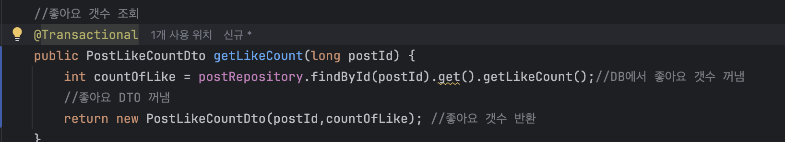
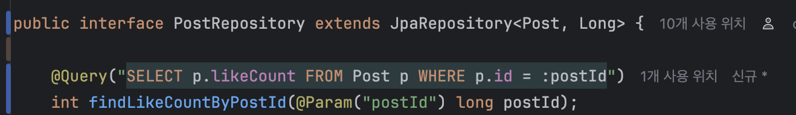
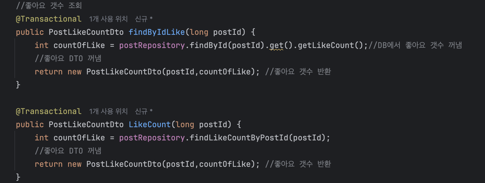
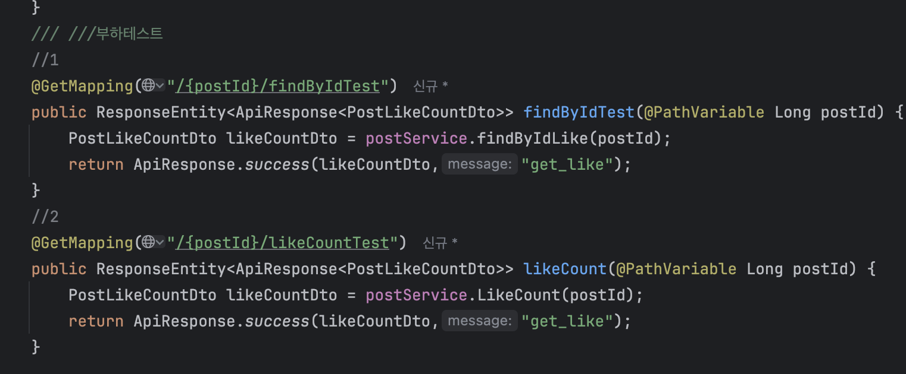
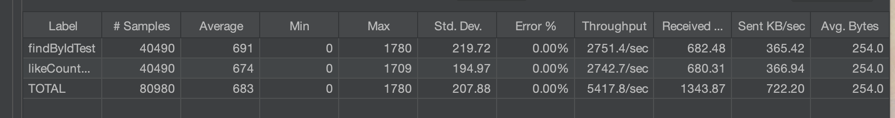
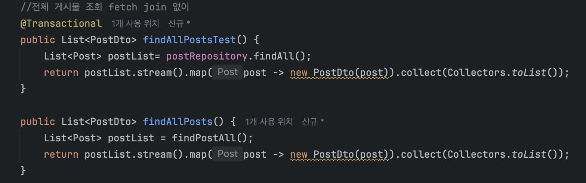
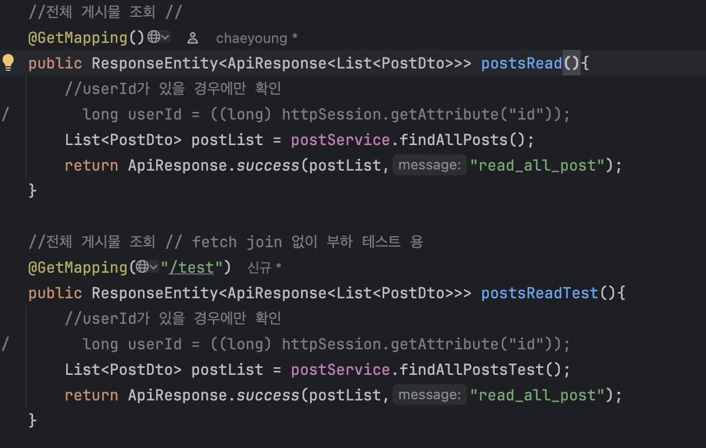
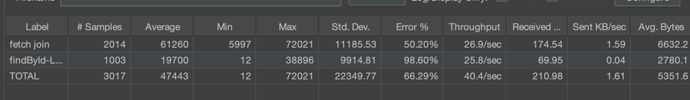

# `findById`로 엔티티를 통째로 가져오는 것이 과연 문제일까?

## 1. 문제 제기

특정 필드(LikeCount)만 필요한 상황에서, 다음 두 가지 접근 방식 중 어떤 것이 더 효율적인지 궁금해졌다.

### A. `findById(postId).get().getLikeCount()`

* `findById`는 **엔티티 전체를 SELECT** 한다.
* 하지만 나는 그중 **likeCount 하나만** 사용한다.
* “그럼 엔티티 전체를 불러오는 건 낭비 아닐까?”라는 의문이 생겼다.



### ⚡ B. JPQL로 필요한 필드만 SELECT

```java
@Query("SELECT p.likeCount FROM Post p WHERE p.id = :postId")
```

* DB에서 필요한 값만 조회한다.
* 당연히 더 가볍지 않을까?

이 단순한 호기심 때문에 성능 테스트에 빠졌고,
이후 JMeter까지 돌리며 "성능 직관이 항상 맞는 건 아니다"라는 것을 몸소 느꼈다.

---

# 2. 가설

* *필드 1개만 가져오는 JPQL이 전체 엔티티를 조회하는 findById보다 빠를 것이다.*

→ 하지만 JPA 내부 최적화 여부도 궁금했고, 실제 체감 차이가 있는지 직접 확인해보고 싶었다.

---

# 3. 실험 (JMeter Load Test)

### 비교 대상 API 두 개 생성

* **findByIdLike()**
  → `findById`로 엔티티 전체 조회 후 LikeCount만 반환
* **likeCount()**
  → JPQL로 likeCount 필드만 반환





- 비교를 위해 2개의 api 생성



---

# 4. 결과 분석 — 확실한 차이는 있지만 “극적”이진 않다



| 항목               | 평균 응답(ms)  | 최대 응답(ms) | 표준편차  | Throughput       | Error % |
| ---------------- | ---------- | --------- | ----- | ---------------- | ------- |
| `findByIdTest` | **691 ms** | 1780      | 219.7 | 2751.4 req/s     | 0%      |
| `likeCountTest` | **674 ms** | **1709**  | 195.0 | **2742.7 req/s** | 0%      |

### ✔ 결론

* **JPQL 단일 필드 조회가 조금 더 빠르긴 하다.**
* 하지만 **체감할 정도로 큰 차이는 아니다.**

→ 즉, “큰 규모 시스템에서 매 요청이 수십만 건씩 발생”하지 않는다면
**둘 다 실용적으로 큰 차이는 없음.**

---

# 5. 확실한 차이가 난 테스트 — fetch join vs lazy 로딩

이번에는 더 큰 차이가 나도록 **데이터의 양을 늘려** 테스트해보기로 했다.

* 게시글 100개
* 각 게시글마다 댓글 100개 (총 10,000개)

→ 즉, N+1, fetch join, lazy 성능을 비교하기 딱 좋은 환경.

### 테스트 대상

* **fetch join으로 Post + User + Comment 전체를 한 번에 가져오기**
* **findById로 Post만 가져오기 (Comment는 lazy)**





---

# 6. 결과 — 이건 정말 ‘극명한 차이’



| 항목          | fetch join          | findById (lazy)     |
| ----------- | ------------------- | ------------------- |
| #Samples    | 2014                | 1003                |
| **평균 응답시간** | **61,260 ms (61초)** | **19,700 ms (20초)** |
| Min / Max   | 5,997 / 72,021      | 12 / 38,896         |
| Error %     | 50.20 %             | 98.60 %             |
| Throughput  | 26.9/sec            | 25.8/sec            |
| Avg Bytes   | 6,632 B             | 2,780 B             |

### ✔ 결론

* fetch join은 데이터가 많을 때 **응답시간이 3배 가까이 증가**
* 무겁게 조인된 엔티티는 그만큼 **패킷 크기도 커지고, 직렬화 비용도 증가**
* lazy 로딩은 필요한 순간에만 조회하므로 **초기 요청이 압도적으로 가벼움**

### 📝 후기

* “사용자 수 때문인가?” 싶었는데 **더미데이터 수 때문**이었다.
* 진짜로 맥북이 뜨거워지고 JMeter가 고통스러워했다.
* RunCat 고양이: 평소보다 3배는 더 뛰어다님.

---

# 7. 종합 결론

### ✔ 1) 필드 하나만 가져오는 JPQL이 findById보다 아주 약간 빠르다.

→ 하지만 실무 체감은 미미함.

### ✔ 2) 데이터가 많을 때 fetch join은 성능을 크게 악화시킨다.

→ 특히 “Post + User + Comment + …” 같은 다중 조인 시 매우 주의해야 함.

### ✔ 3) Lazy + 필요한 순간 네트워크 요청 분리 방식이 더 안정적인 경우도 많다.

→ 모든 것을 한 번에 가져오면 오히려 ‘덩치 큰 요청’이 되어 부담 증가.

